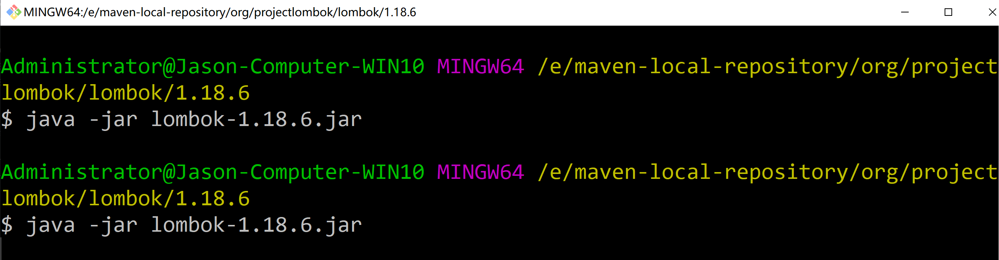
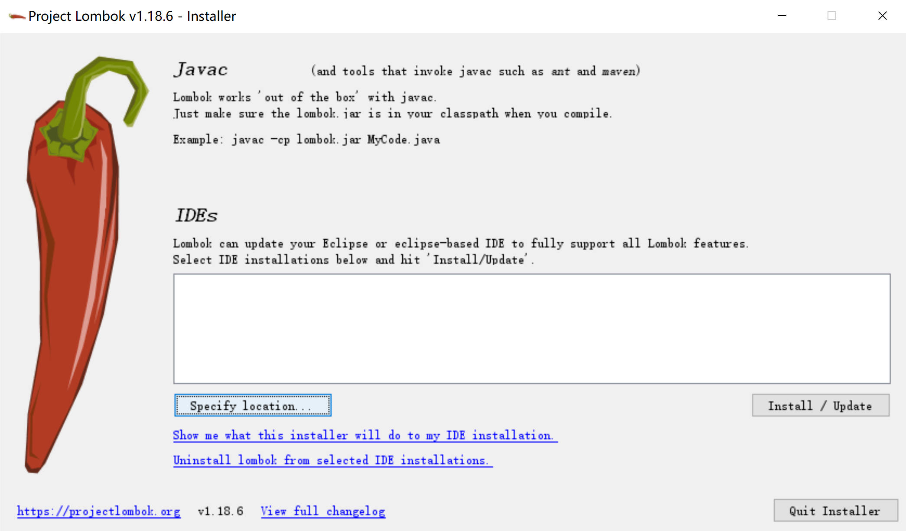
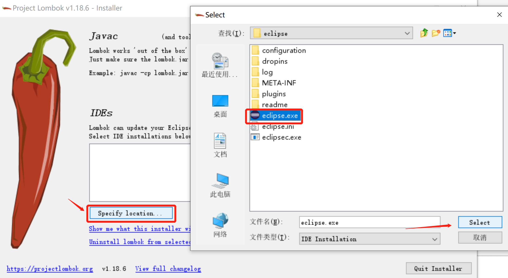
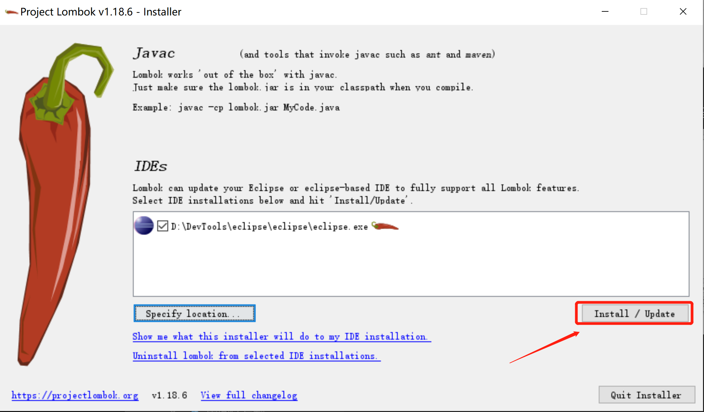
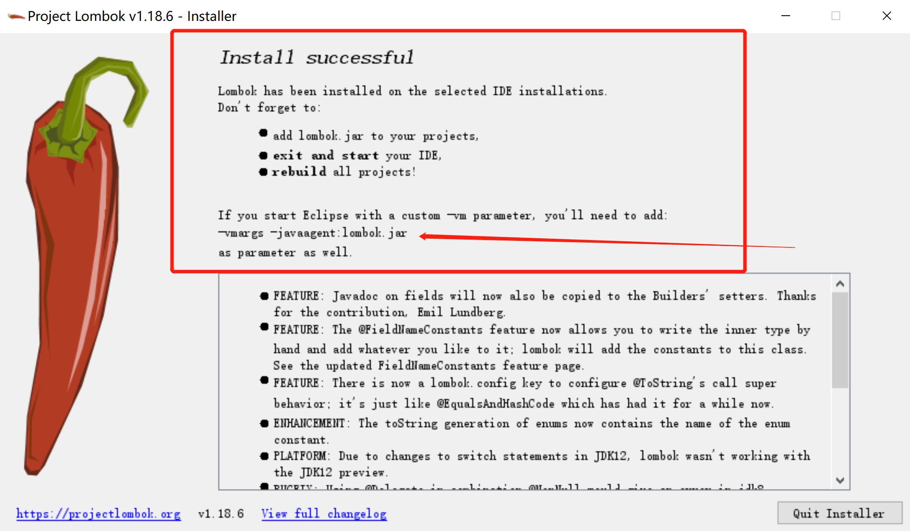
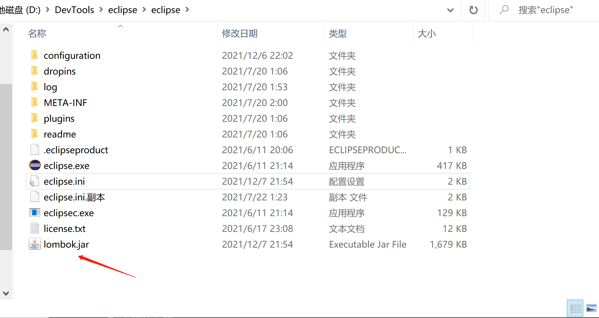

# Lombok代码生成插件使用

## 步骤

### 1、下载Project Lombok Installer

版本:v1.18.6

### 2、执行jar进行编辑器安装

Eclipse、Spring Tool Suite

```PowerShell
$ java -jar lombok-1.18.6.jar
```














安装成功后，会在自动拷入lombok.jar。

### 3、配置文件

配置eclipse.ini或SpringToolSuite4.ini，在*.ini文件中加入：

```PowerShell
-javaagent:lombok.jar
```


### 4、创建lombok-demo项目

pom.xml

```xml
<project xmlns="http://maven.apache.org/POM/4.0.0"
	xmlns:xsi="http://www.w3.org/2001/XMLSchema-instance"
	xsi:schemaLocation="http://maven.apache.org/POM/4.0.0 https://maven.apache.org/xsd/maven-4.0.0.xsd">
	<modelVersion>4.0.0</modelVersion>
	<groupId>com.codedok.lombok</groupId>
	<artifactId>lombok-demo</artifactId>
	<version>0.0.1-SNAPSHOT</version>
	<packaging>jar</packaging>
	
	<properties>
		<compiler.version>1.8</compiler.version>
		<java.source.version>1.8</java.source.version>
		<java.target.version>1.8</java.target.version>
		<file.encoding>UTF-8</file.encoding>
	</properties>

	<dependencies>
		<dependency>
			<groupId>org.projectlombok</groupId>
			<artifactId>lombok</artifactId>
			<version>1.18.6</version>
		</dependency>

		<dependency>
			<groupId>org.projectlombok</groupId>
			<artifactId>lombok-maven-plugin</artifactId>
			<version>1.18.20.0</version>
			<scope>provided</scope>
		</dependency>
	</dependencies>
	
	<build>
        <plugins>
            <!-- Java Compiler -->
            <plugin>
                <groupId>org.apache.maven.plugins</groupId>
                <artifactId>maven-compiler-plugin</artifactId>
                <configuration>
                    <compilerVersion>${compiler.version}</compilerVersion>
                    <source>${java.source.version}</source>
                    <target>${java.target.version}</target>
                    <encoding>${file.encoding}</encoding>
                </configuration>
            </plugin>
            <plugin>
                <groupId>org.apache.maven.plugins</groupId>
                <artifactId>maven-source-plugin</artifactId>
                <executions>
                    <execution>
                        <id>attach-sources</id>
                        <goals>
                            <goal>jar</goal>
                        </goals>
                    </execution>
                </executions>
            </plugin>
            <plugin>
                <groupId>org.apache.maven.plugins</groupId>
                <artifactId>maven-javadoc-plugin</artifactId>
                <configuration>
                    <charset>${file.encoding}</charset>
                    <encoding>${file.encoding}</encoding>
                </configuration>
                <executions>
                    <execution>
                        <id>attach-javadocs</id>
                        <goals>
                            <goal>jar</goal>
                        </goals>
                    </execution>
                </executions>
            </plugin> 
            <plugin>
                <groupId>org.projectlombok</groupId>
                <artifactId>lombok-maven-plugin</artifactId>
                <version>1.18.20.0</version>
                <configuration>
                    <encoding>${file.encoding}</encoding>
                </configuration>
                <executions>
                    <execution>
                        <phase>generate-sources</phase>
                        <goals>
                            <goal>delombok</goal>
                        </goals>
                    </execution>
                </executions>
            </plugin>
        </plugins>
    </build>
    <profiles>
        <profile>
            <id>lombok-needs-tools-jar</id>
            <activation>
                <file>
                    <exists>${java.home}/../lib/tools.jar</exists>
                </file>
            </activation>
            <build>
                <plugins>
                    <plugin>
                        <groupId>org.projectlombok</groupId>
                        <artifactId>lombok-maven-plugin</artifactId>
                        <version>1.18.20.0</version>
                        <dependencies>
                            <dependency>
                                <groupId>sun.jdk</groupId>
                                <artifactId>tools</artifactId>
                                <version>1.6</version>
                                <scope>system</scope>
                                <systemPath>${java.home}/../lib/tools.jar</systemPath>
                            </dependency>
                        </dependencies>
                    </plugin>
                </plugins>
            </build>
        </profile>
    </profiles>
	
</project>
```


User.java

```java
package com.codedot.lombok.model;

import java.io.Serializable;
import java.util.Date;

import lombok.AllArgsConstructor;
import lombok.Data;
import lombok.NoArgsConstructor;

@Data
@AllArgsConstructor
@NoArgsConstructor
public class User implements Serializable, Cloneable {

  private static final long serialVersionUID = 1L;
  
  private Long id;
  
  private String username;
  
  private String email;
  
  private Date birthday;
  
  @Override
  protected Object clone() {
    User user = null;
    try {
      user = (User) super.clone();
    } catch (CloneNotSupportedException e) {
      return null;
    }
    user.setBirthday(this.getBirthday());
    return user;
  }
  
  
}

```


加入Lombok注解

```java
@Data
@AllArgsConstructor
@NoArgsConstructor

@Data(自动生成Get、Set方法，
以及equals()、canEqual()、hashCode()，toString()方法)


```


LombokDemoTest.java

```java
package com.codedot.lombok.test;

import java.util.Date;

import com.codedot.lombok.model.User;

public class LombokDemoTest {
  
  public static void main(String[] args) {
    User user = new User();
    user.setId(9982313891523L);
    user.setEmail("jason@gmail.com");
    user.setUsername("jason");
    user.setBirthday(new Date(2018, 11, 25));
    
    System.out.println(user);
    
  }

}

```


运行结果：

```java
User(id=9982313891523, username=jason, email=jason@gmail.com, birthday=Wed Dec 25 00:00:00 CST 3918)

```


