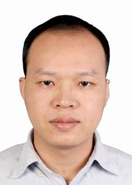

标签： #职业 #简历 

### 我的简历

            

**个人简历**

**姓 名：魏俊强**

**性 别：男**

**出生日期：1988-12-24**

**民 族：汉族**

**毕业院校：广东科学技术职业学院**

**学 历：大专**

**专 业：软件工程**

**工作年限：9年**

**手机/微信：15920985866**

**邮 箱：659194256@qq.com**

**职业技能：**

**精通****：** 分布式、高并发、多线程、数据结构与算法、设计模式、大数据处理、柔性事务、微服务、Linux(shell脚本编程) 、Nginx 、lvs、disconf 、elasticsearch、 elk+beats 、sharding-jdbc、 spring-mvc、spring-cloud(spring boot)、quartz 、jpa、mybatis 、http、netty、mina、thrift、MySQL、MariaDB、tungsten、noSQL（couchBase,memcache,redis,codis,mongodb）、mq(kafka、activemq、rabbitmq)、zookeeper、svn、ant、Gradle、tomcat

**常用工具：**eclipse、IDEA、Android Studio、VS Code、PyCharm、Postman 

**熟悉：** 爬虫、docker、dubbo、dubbox、mycat、elastic-job、jvm 、hudson(Jenkins)、swing、JFX、jBoss、Python、 Jquery、Android、 artifactory、easyui、 HTML5、CSS、JS、bootstrap、highcharts、VUE、Angular

**了解：** C、C++、 AS3、Hadoop/Hive/Hbase、Storm

**求职意向：**

**目标职位：**

Java工程师、全栈开发工程师、架构师

**公司类型：**

B2B、O2O、Saas、PaaS、金融、教育、政府、互联网

**工作城市：**

广州

**到岗时间：**

随时

**目前月薪：**

26K

**期望薪资：**

28K+

**项目经验：** 

**2015.9** **至 2021.6 广州青云直上信息科技有限公司**

**担任职位: 研发部经理、全栈开发工程师、架构师**

**产品/项目：跨屏办公系统 + 云盘系统 + VPN系统 + net穿透域名解析系统 + （外包项目：广州医保局双网隔离无纸化办公、广州社保局双网隔离无纸化办公、长大三公司内部考核系统、广州海格通信双网隔离系统、广东省粤运交通集团（越秀）双网隔离系统、肇庆烟草精品营销系统、广州市荔湾区城市管理综合执法系统）**

**下属人数: 7（2个C/C++开发、2个Java开发、1个php开发；1个测试；1个运维）**

**汇报对象: 公司股东、外包主管（甲方）**

**项目职责：**

1. 2015年9月与其他3位股东共同创立公司，担任研发部经理，负责公司产品研发，研发部管理工作及参与公司发展事务（包括不限于：客户定位、客户拜访、投标、贷款、知识产权等）

2. 市场同类竞品分析，目标客户需求收集与分析，产品设计，技术架构选型，系统架构搭建，负责项目的前期需求分析、系统功能分析、系统框架设计、策划、项目开发进度的跟踪、项目质量的检查

3. 每日站会（昨日工作检查，今日任务安排；每位成员问题询问，技术难点分析，提供解决方案），根据业务需求，分配任务，落实任务、跟踪完成进度（测试及代码审查）

4. 新技术引入前测试，修改源码、编译、打包成依赖库；搭建运维环境，部署项目（编写Shell脚本，Linux下自动部署）

5. 培养人才（知无不答，倾囊相授，一对一编码指导）；技术路线指导；私费下午茶/晚餐，促进内部团结

6. 对其它项目进行技术指导，解决方案支持；产品实施现场跟踪，现场问题解决（物理网络排查、服务器负载检测分析、平台系统版本-更换-更新升级、现场代码修改补救）；外包客户现场需求收集分析，问题协调与解决

**2015.9** **至 2021.6 广州青云直上信息科技有限公司**

**担任职位: 研发部经理、全栈开发工程师、架构师**

**产品/项目：跨屏办公系统 + 云盘系统 + VPN系统 + net穿透域名解析系统 + （外包项目：长大三公司内部考核系统、广州海格通信双网隔离系统、肇庆烟草精品营销系统、广州市荔湾区城市管理综合执法系统）**

**下属人数: 7（2个C/C++开发、2个Java开发、1个php开发；1个测试；1个运维）**

**汇报对象: 公司股东、外包主管**

**项目职责：**

1. 2015年9月与3位同行共同创立公司，担任研发部经理，负责公司产品研发，研发部管

2. 市场同类竞品分析，目标客户需求收集与分析，产品设计，技术架构选型，系统架构搭建

3. 每日站会（昨日工作检查，今日任务安排；每位成员问题询问，技术难点分析，提供解决方案），根据业务需求，分配任务，落实任务、跟踪完成进度（测试及代码审查）

4. 新技术引入前测试，改源码，编译；搭建运维环境，部署项目（编写Shell脚本，Linux下自动部署）

5. 培养人才（知无不答，倾囊相授）；技术路线指导；私费下午茶/晚餐，促进内部团结

6. 对其它项目进行技术指导，解决方案支持；产品实施现场跟踪，现场问题解决；外包客户现场需求收集分析，问题协调与解决

**项目描述：**

网上抓取有关tcl的数据，然后进行数据清洗，最后业务人员跟踪负面信息，处理好负面新闻

把tcl所有员工相关的数据、用户相关的行为数据整合起来，统一管理

爬虫：

1． 网关方面不走正常的机房办公路线，独立一条专门的爬虫路线（保护其他项目的流量）

2． 搭建ip代理服务，更好的抓取数据

3． 使用微服务处理不同的渠道（这里使用的是spring cloud，跟dubbo一样的），可以根据实际抓取需求定量控制渠道节点

4． 发布方面结合docker，部署方便，维护方便

5． 消息缓存中间件使用kafka，管理中心使用spring mvc，通过netty通信

6． 去重中心使用redis集群

 舆情系统：

1． 数据库使用mysql ，分片规则是水平切分，按时间划分，使用了当当网的sjdbc数据库中间件（比mycat更好用，开源做的更出色）

 2. 业务查询方面使用了 elasticsearch ，按时间分片（建立索引），按品牌路由，使用ik分词器，使用了G1GC 垃圾回收 ， 配置了高可用

 3. 日记采集方面使用了 elk+beats +kafka

 4. 采用前后端隔离，前端采用nginx，后端采用spring cloud

 5. 通过nginx限流、防刷、缓存加速，负责均衡

6． 配置文件管理采用 disconf

7． 使用jwt管理session(比spring session 更强)

8. 分布式锁，如果是用于服务器高可用和切换的用ZK，业务用redis (redisson)

用户在线：

1. 从0搭建大数据CDH平台，根据业务需要使用hadoop、hive、kudu、flume、hue、impala、sqoop、kafka等相关组件

2. 搭建ETL 过程，离线使用hue平台，实时流使用streamSets

3. 普通的业务，ETL流程如下：业务数据 -> kafka -> kudu(脚本) -> cdh , 业务数据 -> kafka -> streamSets->hive->impala(es) ， 业务数据文本数据-> mr脚本 -> 结果数据 -> hue ->hive -> impala

4. 复杂的业务， streamSets处理之后 -> hue（定时处理） -> impala(sql式etl) -> impala (es)

5. 业务系统采用spring boot2 + es6.2 + mysql5.7+kafka1.01 +redis+nginx，前后端分 离方案

6. 分库分表使用sharding-jdbc，api文档使用swagger,配置文件管理使用disconf

 管理工具: Jenkins、svn、gradle、maven、nexus

一共两次业绩总结，一次拿s，一次拿a

**离职原因：**

个人发展

**2012.06****至 2015.08 广州微胜科技有限公司**

**担任职位: java工程师**

**下属人数: 无**

**汇报对象: 主程**

**项目职责：**

1 重要模块的研发

2 项目工具研发

3 后台管理平台研发

4 腾讯充值sdk对接

5 搭建环境、发布项目

**项目描述：**

典型的rpg页游项目，游戏名“钢铁少女”，战舰机械风格，可参考“_千军破”_

**离职原因：**

 个人发展

**教育&工作经历：**

**2009.09 - 2012.06**

广东科学技术职业软件工程专业

**自我评价：**

经常参加技术交流会，喜欢结识各种技术大牛, 9年半工作经验，带过4个团队，5年架构师经验，为公司节省了近千万，最近一家单位一共两次业绩评选，一次拿s一次拿a，关注开源项目，能根据业务需求改写源码

